# 🔬 Solana Transaction Re-Execution & Debugger Architecture (Step 1)

This document provides a comprehensive technical overview of **Step 1** in building our **Solana Debugger**. It explains how transactions are sent, re-executed (replayed/simulated), and analyzed using Rust and Solana's RPC simulation engine.

---

## 🎯 Executive Summary for the Team

In Solana development, debugging a transaction failure (e.g., custom Anchor program error `0x1770`, compute budget exhaustion, or account constraint mismatch) can be difficult if you only rely on raw transaction signatures.

**Step 1** of our Solana Debugger solves this by establishing a **Re-Execution Engine**. We can:
1. Construct and broadcast transactions to a local or remote Solana cluster.
2. Re-execute (replay/simulate) the exact transaction against target ledger states.
3. Extract VM invocation traces (`Program log`), Compute Unit (CU) consumption, error details, and account balance changes.

---

## 🏗️ Architecture & Execution Flow

Below is the workflow implemented in [`src/main.rs`](file:///home/vedran/dev/solana-debugger/src/main.rs):

```mermaid
sequenceDiagram
    autonumber
    actor Dev as Developer / CLI
    participant Client as Debugger Engine (Rust)
    participant RPC as Solana RPC Node
    participant VM as Solana VM (Sealevel)

    Dev->>Client: Run Debugger (`cargo run`)
    Client->>RPC: 1. Fetch recent blockhash & account balance
    Client->>RPC: 2. Broadcast signed transaction (`send_and_confirm_transaction`)
    RPC->>VM: Execute transaction on chain
    VM-->>RPC: Confirm block commitment
    RPC-->>Client: Return Tx Signature
    
    rect rgb(30, 40, 60)
        note over Client, VM: Step 2: Transaction Re-Execution & Simulation Phase
        Client->>RPC: 3. Re-execute tx (`simulate_transaction_with_config`)
        RPC->>VM: Dry-run transaction pipeline against temporary bank state
        VM-->>RPC: Capture VM logs, CU consumed, and return data
        RPC-->>Client: Return `RpcSimulateTransactionResult`
    end

    Client->>Dev: 4. Output Debugger Diagnostics Report
```



---

## 🔍 Detailed Breakdown: How Re-Execution Works

### 1. Transaction Assembly & On-Chain Broadcast
- We create a standard Solana transaction containing instructions (e.g. `SystemProgram::transfer`).
- The transaction is signed by the payer's keypair (`~/.config/solana/id.json`) and submitted to the validator via RPC `send_and_confirm_transaction`.

### 2. The Re-Execution Engine (`simulate_transaction_with_config`)
- **Deterministic State Machine**: Solana's execution runtime (Sealevel) is deterministic. Given the same instructions, keypairs, and block state, execution yields identical results.
- **Non-Mutating Dry Run**: Unlike broadcasting a transaction to be mined into a block, `simulateTransaction` creates a transient VM environment (a temporary bank fork).
- **Configuration**:
  ```rust
  let config = RpcSimulateTransactionConfig {
      sig_verify: false,               // Bypasses signature verification for speed
      replace_recent_blockhash: true,  // Automatically updates blockhash to prevent expiration
      commitment: Some(CommitmentConfig::confirmed()),
      encoding: None,
      accounts: None,
      min_context_slot: None,
      inner_instructions: true,        // Captures CPI (Cross-Program Invocations)
  };
  ```

### 3. Captured Debugger Diagnostics
When `simulate_transaction_with_config` executes, it returns an `RpcSimulateTransactionResult` containing:
- **`err`**: `None` on success, or `Some(TransactionError)` indicating failure (e.g., `InstructionError(0, Custom(6000))`).
- **`units_consumed`**: Total Compute Units (CU) consumed by the transaction execution pipeline.
- **`logs`**: Full stack trace of program logs (`meta.logMessages`) emitted during execution.

---

## 📊 Sample Debugger Report Output

When running `cargo run`, the debugger generates the following report:

```text
🌐 Connecting to Solana RPC: http://127.0.0.1:8899
🔑 Loading keypair from "/home/vedran/.config/solana/id.json"
   Sender Pubkey:    FQzTFaxQ9cibquRpatnx9fgymLY16b1cGYtnytGbmSde
   Recipient Pubkey: Eg2vQvN9XZ4jzfojXXi2zFQoGMBrvjiDHBQaMW9kXKS7
💰 Sender initial balance: 9.998985 SOL

=======================================================
🚀 STEP 1: SENDING ORIGINAL TRANSACTION TO SOLANA NETWORK
=======================================================
✅ Transaction successfully confirmed!
   Tx Signature: 5Y1qZQwQjWQu7BTi2XKMuZyjdWBJ4U2Bh6xkhyEnKExcUrvdWyJJ5pCaLvpv2bpigg8trMPy9sgheCeVDo1Szanu
   Sender Balance After Tx:    9.94898 SOL
   Recipient Balance After Tx: 0.05 SOL

=======================================================
🔬 STEP 2: RE-EXECUTING (REPLAYING/SIMULATING) THE TRANSACTION
=======================================================
ℹ️  Re-execution allows us to dry-run/inspect transaction execution
   against local or remote state without mutating the ledger.

--- 📊 SOLANA RE-EXECUTION REPORT ---
Status:           SUCCESS ✅
Compute Units:    150 CU

--- 📜 VM EXECUTION LOGS (Program Traces) ---
  [01] Program 11111111111111111111111111111111 invoke [1]
  [02] Program 11111111111111111111111111111111 success
```

---

## 💡 Why This is Essential for Our Solana Debugger

1. **Local Reproduction**: Re-execution allows us to pull any transaction signature from mainnet/devnet and replay it locally to reproduce failures reliably.
2. **Anchor IDL Error Mapping**: In Phase 2, we will use the raw hex error codes extracted from `sim_result.err` and `logs` to map them directly to Anchor IDL error names (e.g. `ConstraintMut`, `SlippageExceeded`).
3. **Compute Unit Profiling**: By analyzing `units_consumed`, developers can optimize compute budgets and avoid transaction drops during high congestion.

---

## 🚀 How Teammates Can Run This

1. **Start Validator**:
   ```bash
   solana-test-validator
   ```
2. **Run Debugger**:
   ```bash
   cargo run
   ```
