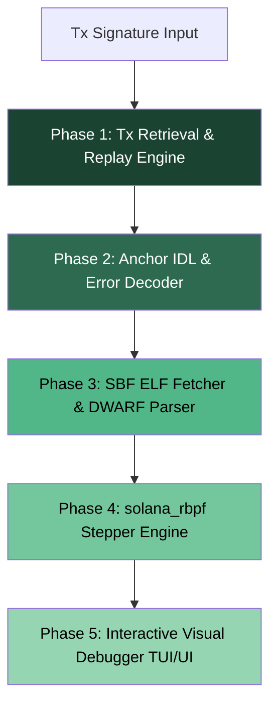

# 🗺️ Solana Debugger Architecture & Master Plan: Source-Level Transaction Trace

This document outlines the master technical design, architecture, and step-by-step roadmap for building a source-level Solana Debugger that takes a **transaction hash (signature)** and pinpoints the **exact line of code** where the transaction failed.

---

## 📐 1. How Solana Compilation & Execution Work Under the Hood

To map an on-chain transaction failure back to a specific line of code, we must understand the lifecycle of a Solana program:

```
[Rust Source Code (lib.rs)] 
       │
       ▼  cargo-build-sbf (LLVM)
[SBF Shared Object (.so) ELF Binary] 
   ├── .text (SBF Bytecode Instructions)
   └── .debug_line (DWARF Debug Symbols: PC Offset ➔ file.rs:line)
       │
       ▼ solana program deploy
[On-Chain Program Account (BPF Loader)]
       │
       ▼ Transaction Execution
[Solana VM / solana_rbpf Runtime]
```

1. **Compilation**: Rust source code is compiled into **Solana Bytecode Format (SBF)** — a variant of eBPF — yielding an ELF binary (`.so`).
2. **DWARF Debug Symbols**: When compiled with debug information, LLVM embeds a `.debug_line` section into the ELF. This section contains a line table mapping every Program Counter ($PC$) offset in the bytecode to `(filename, line_number, column)`.
3. **On-Chain Storage**: The `.so` binary is deployed into a program account owned by `BPFLoaderUpgradeab1e11111111111111111111111`.
4. **Execution**: The Solana VM (`solana_rbpf`) executes SBF instructions. If a crash or error occurs, the VM halts at a specific Program Counter ($PC$).

---

## 🧠 2. How Bytecode is Mapped to Source Code (Two Debugging Levels)

### Level A: High-Level Anchor IDL & Log Error Decoding (No Debug Symbols Needed)
*For 95% of real-world mainnet transactions where programs are deployed in release mode:*
- **Instruction Data Decoding**: The first 8 bytes of instruction data is the Anchor instruction discriminator. We match this against the program's **Anchor IDL** to get the function name (e.g. `swap`, `liquidate`) and decode parameter values.
- **Error Code Translation**: When a program fails, the VM logs emit a hex error code (e.g., `Hex: 0x1770` $\rightarrow$ `6000`). We lookup `6000` in the IDL error table to reveal `SlippageExceeded`.
- **Log Location Hints**: Anchor automatically includes source file hints in logs for constraint failures (e.g., `AnchorError thrown in src/state.rs:45. ConstraintHasOne violated`).

### Level B: Low-Level SBF DWARF Line-Table Mapping & Stepper (Exact Line Debugging)
*For exact line-by-line debugging of custom or local/devnet programs:*
- **Bytecode Fetching**: Fetch the program's compiled SBF binary from the blockchain using `get_account_info(program_id)`.
- **DWARF Parsing (`gimli` crate)**: Parse the `.debug_line` section of the ELF binary to construct an in-memory map: `Program Counter (PC) ➔ (file.rs, line_number)`.
- **In-Process VM Replay (`solana_rbpf`)**: Load the transaction state into an embedded `solana_rbpf` VM.
- **Step-by-Step Execution**: As the VM steps through instructions, inspect the current $PC$. When an exception occurs, look up $PC$ in the DWARF line table to highlight the exact line of code.

---

## 🗺️ 3. Master Step-by-Step Roadmap



### ✅ Phase 1: Core Replay Engine (COMPLETED)
- Connect to RPC node.
- Send transaction and execute dry-run simulation via `simulateTransaction`.
- Capture raw execution status, Compute Units (CU), and VM logs.

### 🎯 Phase 2: Anchor IDL & Instruction Error Decoder (NEXT STEP)
- **Goal**: Convert raw hexadecimal error codes and instruction hex bytes into human-readable error names and function calls.
- **Tasks**:
  1. Fetch Anchor IDL from on-chain or program repository.
  2. Parse 8-byte Anchor discriminators to identify instruction names.
  3. Map hex error codes (`0x1770` $\rightarrow$ `6000`) $\rightarrow$ `AnchorError::SlippageExceeded`.
  4. Extract account validation failure messages.

### 🛠️ Phase 3: SBF ELF & DWARF Line-Table Parser
- **Goal**: Download program SBF `.so` binary and extract source code location tables.
- **Tasks**:
  1. Read program executable account data (`BPFLoaderUpgradeab1e`).
  2. Use Rust crate `gimli` / `object` to parse `.debug_line` tables.
  3. Build lookup index: `PC Offset ➔ (Source File, Line Number)`.

### ⚡ Phase 4: Local `solana_rbpf` Execution Stepper
- **Goal**: Execute transactions inside an embedded Solana VM stepper.
- **Tasks**:
  1. Load transaction input accounts into `solana_program_runtime` / `solana_rbpf`.
  2. Single-step SBF execution while tracking $PC$ ticks.
  3. Capture exact $PC$ where panics, overflow, or exit codes trigger.

### 📺 Phase 5: Interactive Visual Debugger (CLI / UI)
- **Goal**: Full developer dashboard.
- **Features**:
  - Input: Tx Signature in search bar.
  - Call Stack Tree: Shows program invocations (CPI trace).
  - Code View: Highlights exact failing line of code with error tooltip.
  - State Diff: Pre vs. Post account balance and data mutations.

---

## 🎯 Immediate Next Step: Phase 2 Implementation Plan

For our next coding iteration, we will implement **Phase 2: Anchor IDL & Instruction Error Decoder**:

1. **IDL Fetcher Module**: Retrieve IDL JSON for any given `program_id`.
2. **Discriminator & Error Decoder**: Given raw instruction bytes & log strings, output:
   - Function invoked (e.g. `transfer_tokens(amount: 500)`)
   - Decoded error (e.g. `Error 6000: Custom error message`)
3. **Integration**: Enhance our CLI output so that running `cargo run` prints human-readable instruction names and decoded errors alongside VM traces.
